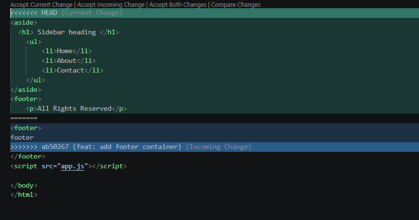
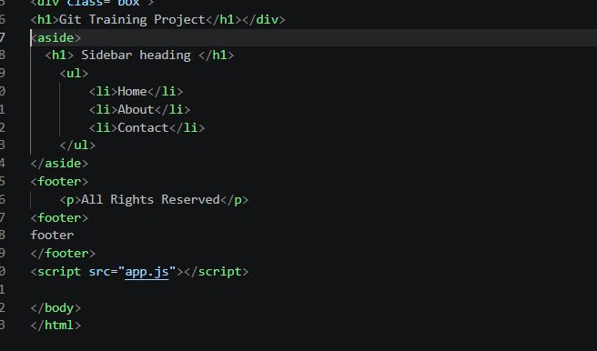
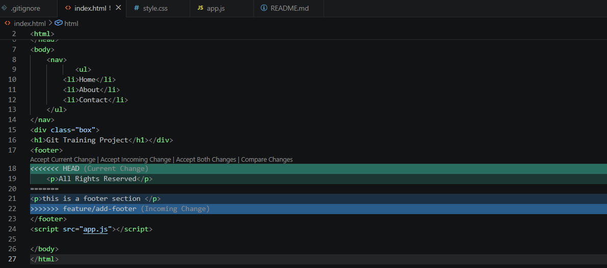

# CONFLICTS.md

# Merge and Rebase Conflict Resolution


# Conflict 1: Merge Conflict

## Branches Involved

- `main`
- `feature/add-footer`

---

## Cause of the Conflict

The merge conflict occurred because both the `main` branch and the `feature/add-footer` branch modified the same section of the `index.html` file. Since Git could not automatically decide which version to keep, it stopped the merge and displayed conflict markers.

---

## Conflict_Screenshot




## Resolution

I reviewed both versions of the code and selected the changes that matched the project requirements. After removing the conflict markers (`<<<<<<<`, `=======`, `>>>>>>>`), I verified the file, staged it using `git add`, and completed the merge with a commit.



---

## Commands Used

```bash
git merge feature/add-footer
git status
git add index.html
git commit
```

---

# Conflict 2: Rebase Conflict

## Branches Involved

- `feature/rebase-demo`
- `main`

---

## Cause of the Conflict

While rebasing the `feature/rebase-demo` branch onto the latest `main` branch, both branches contained changes in the same section of `index.html`. Git paused the rebase because it could not automatically combine the changes.

---

## Conflict_Screenshot



---

## Resolution

I manually reviewed the conflicting changes and kept the required code from both branches. After removing the conflict markers, I staged the file and continued the rebase using `git rebase --continue`.


---

## Commands Used

```bash
git rebase main
git status
git add index.html
git rebase --continue
```

---

# Learned

- Merge conflicts occur when two branches modify the same part of a file.
- Rebase conflicts occur when replaying commits onto another branch and the same lines have changed.
- Conflict markers (`<<<<<<<`, `=======`, `>>>>>>>`) help identify the conflicting sections.
- Always review the conflicting code carefully before resolving the conflict.
- After resolving a merge conflict, use `git add` followed by `git commit`.
- After resolving a rebase conflict, use `git add` followed by `git rebase --continue`.